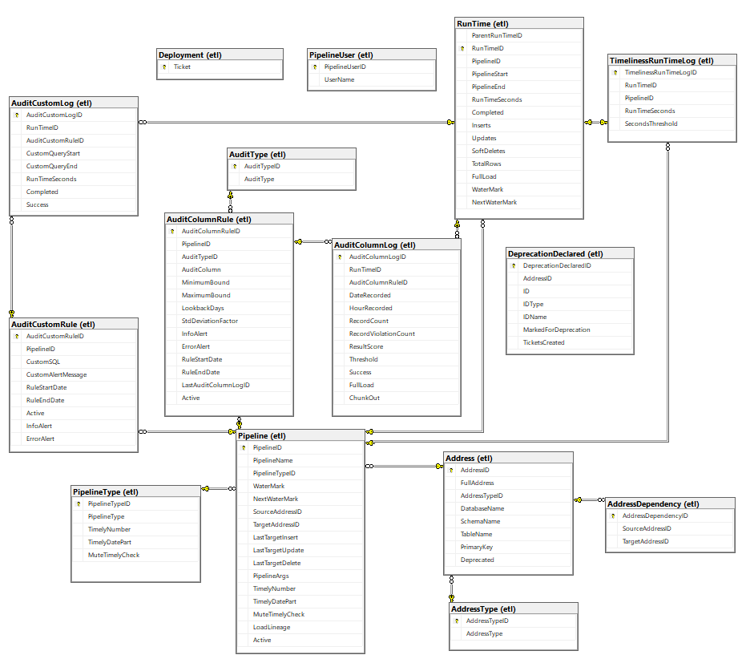

# MSSQL ETL Metadata Framework
**Simplifying Data Management for Scalable, High-Quality ETL Pipelines**

In today's data-driven world, organizations grapple with the challenges of managing ever-growing datasets. As data volumes expand, ensuring efficient extraction, transformation, and loading (ETL) processes becomes increasingly complex. Teams often find themselves wrestling with slow data transfers, lack of visibility into pipeline operations, data quality issues, and difficulties in tracking data lineage. These challenges not only hinder productivity but also impact strategic decision-making.

**Enter the MSSQL ETL Metadata Framework**—a robust solution designed to address these pain points and streamline your data management processes. 


## **The Challenge**

- **Scalability Concerns:** Traditional ETL processes struggle to handle massive datasets efficiently, leading to prolonged processing times and system bottlenecks.
- **Limited Visibility:** Without proper logging and metadata storage, tracking the performance and operations of data pipelines becomes a daunting task.
- **Data Quality Issues:** Ensuring the completeness, accuracy, and timeliness of data is critical, yet difficult to maintain without automated checks.
- **Complex Data Lineage:** Understanding where data comes from and how it flows through systems is essential for compliance and impact analysis but is often neglected.
- **Maintenance Overhead:** Manually cleaning up logs and deprecating outdated pipelines consumes valuable resources.
## **The Solution**

The MSSQL ETL Metadata Framework is designed to tackle these challenges head-on, providing a comprehensive toolkit for building performant, transparent, and quality ETL pipelines within SQL Server environments (2016 onward).

### **Key Benefits**

- **Enhanced Performance and Scalability:**
    - **Efficient Data Chunking:** Break down large datasets into manageable chunks for faster processing. Manage data influxes from upstream pipelines and handle large scale data quality audits with ease.
- **Comprehensive Pipeline Logging and Metadata Storage:**
    - **Operation Tracking:** Monitor data manipulation language (DML) operations for each run, giving you clear insights into what changes are occurring.
    - **Run-Time Monitoring:** Keep an eye on pipeline performance over time to identify and address bottlenecks promptly.
    - **Incremental Load Management:** Store watermarks to seamlessly handle incremental data loads without reprocessing entire datasets.
- **Robust Data Quality Framework:**
    - **Automated Audits:** Implement scalable checks for data completeness, accuracy, and timeliness automatically.
    - **Custom Validation Rules:** Define and execute your own data quality rules to meet specific business requirements.
	- **Alerting:** Alerting hooks available for SQL Server Database Mail
- **Transparent Data Lineage Tracking:**
    - **Dependency Mapping:** Document data sources and destinations—including files, tables, and reports—to understand data dependencies fully.
    - **Impact Analysis:** Quickly assess how changes to one part of your data ecosystem might affect other components.
- **Automated Maintenance Features:**
    - **Log Cleanup Automation:** Set retention policies to automatically delete old logs, ensuring optimal performance and compliance with data governance policies.
    - **Pipeline Deprecation Process:** Safely retire outdated pipelines, helping to maintain a clean and efficient data environment.
## Table of Contents
1. [Setup](#Setup)
2. [Database Diagram](#Database-Diagram)
7. [Implementation Need-to-Knows](#Implementation-Need-to-Knows)
2. [Tutorial](#Tutorial)  
	1. [Create Necessary Objects](#Create-Necessary-Objects)
	2. [Populate Source Table](#Populate-Source-Table)
	3. [Create Extraction Pipeline](#Create-Extraction-Pipeline)
	4. [Create Audit Rules](#Create-Audit-Rules)
	5. [Create Audit Pipeline](#Create-Audit-Pipeline)
	6. [Create Publish Pipeline](#Create-Publish-Pipeline)
	7. [Create Controller Pipeline](#Create-Controller-Pipeline)
	8. [Deprecate the Publish Address](#Deprecate-the-Publish-Address)
	8. [Delete Test Objects](#Delete-Test-Objects)
3. [Examples](#Examples)  
    1. [Extraction](#Extraction)
    2. [Audit](#Audit)
    3. [Publish](#Publish)
    4. [Publish Merge Stored Procedure Example](#Publish-Merge-Stored-Procedure-Example)
    5. [Controller](#Controller)
    6. [Transformation](#Transformation)
4. [General Documentation](#General-Documentation)  
	1. [Naming a Pipeline](#Naming-a-Pipeline)
    1. [Creating a new Pipeline](#Creating-a-new-Pipeline)
    2. [PipelineArgs](#PipelineArgs)
    3. [WaterMarks](#WaterMarks)
		1. [ChangeTracking](#ChangeTracking)
	4. [Naming an Address](#Naming-an-Address)
    4. [Adding Lineage](#Adding-Lineage)
	5. [Deployment](#Deployment)
		1. [Data Lineage Deployment](#Data-Lineage-Deployment)
		2. [Misc Deployment](#Misc-Deployment)
    6. [Deleting Logs](#Deleting-Logs)
	7. [De-activating a Pipeline](#De-activating-a-Pipeline)
	8. [Table Design Considerations](#Table-Design-Considerations)
		1. [Staging Table Design](#Staging-Table-Design)  
		2. [Published Table Design](#Published-Table-Design)
		3. [Transformation Table Design](#Transformation-Table-Design)
	9. [Deprecation](#Deprecation)  
		1. [First Stage of Deprecation](#First-Stage-Of-Deprecation)
		2. [Second Stage of Deprecation](#Second-Stage-Of-Deprecation)
		3. [Third Stage of Deprecation](#Third-Stage-Of-Deprecation)
5. [Audit Framework](#Audit-Framework)  
    1. [Creating an Audit Column Rule](#Creating-an-Audit-Column-Rule)
    2. [Executing the Audit Framework](#Executing-the-Audit-Framework)
	3. [Composite Primary Key](#Composite-Primary-Key)
	3. [GUID](#GUID)
    3. [Fine Tuning Audit Column Alerts](#Fine-Tuning-Audit-Column-Alerts)
    4. [Timeliness](#Timeliness)
		1. [Pipeline Check](#Pipeline-Check)
		2. [RunTime Check](#RunTime-Check)
		3. [Setting up Timeliness Checks](#Setting-up-Timeliness-Checks)
	5. [Custom Audit Checks](#Custom-Audit-Checks)  
		1.[Creating a Custom Audit Check](#Creating-a-Custom-Audit-Check)  
		2. [Executing Custom Checks](#Executing-Custom-Checks)  
		3. [Logging Custom Checks](#Logging-Custom-Checks)
6. [Stored Procedure Documentation](#Stored-Procedure-Documentation)  
    1. [etl.RunTime_I](#etlRunTime_I)
	14. [etl.PipelineActive_S](#etlPipelineActive_S)
	16. [etl.PipelineUser_SI](#etlPipelineUser_SI)
	5. [etl.Pipeline_UI](#etlpipeline_ui)
    2. [etl.RunTime_U](#etlruntime_U)
    3. [etl.AuditColumnRule_I](#etlAuditColumnRule_I)
	10. [etl.AuditCustomRule_I](#etlAuditCustomRule_I)
	4. [etl.AuditLoad](#etlAuditLoad)
	7. [etl.AuditTimeliness_U](#etlAuditTimeliness_U)
	11. [etl.DeprecationDeclared_UID](#etlDeprecationDeclared_UID)  
	12. [etl.DeprecationFinalCheck](#etlDeprecationFinalCheck)  
	15. [etl.DeprecationFinal_U](#etlDeprecationFinal_U)
	13. [etl.DeprecationFinal_D](#etlDeprecationFinal_D)
	9. [etl.Pipeline_D](#etlPipeline_D)
	6. [etl.LogMaintenance_D](#etlLogMaintenance_D)
	8. [etl.AddressLineage_S](#etlAddressLineage_S)
7. [Misc Notes](#Misc-Notes)  
## Setup
To create all the necessary objects, open the Setup.sql file in the main directory and execute it in your chosen database. Then utilize the examples to set up your own pipeline!
## Database Diagram

## Implementation Need-to-Knows
This repo does not include proper alerting. You will need to configure proper email alerting for the "check" stored procedures. I would recommend setting up SQL Server's Database Mail. You'll find the sections tagged with /* TODO: Configure Database Mail */ for the below sprocs:
1. etl.AuditColumnLogCheck
2. etl.AuditCustomCheck
3. etl.AuditTimelinessPipelineCheck
4. etl.DeprecationFinalCheck  
 
## Tutorial
This tutorial was created for you to easily see the main features of the framework by spinning up an example provided. The three separate jobs of timeliness checks, deprecation notifications, and log maintenance are not included. For ease of scripts and data lineage, I would recommend creating a new database with the name of "ETL_Metadata". I would also recommend turning on ChangeTracking and having the database logging setting be "Simple".  
  
   If you have a different database name, follow the throw error instructions to replace the name. You can also just use Ctrl + F and replace all "ETL_Metadata" words with your database name for each script. Each of the below steps/scripts are located in the Tutorial folder in the following order.
### Create Necessary Objects
This script creates a source table, a staging table, and a publish table. It also creates a merge stored procedure that publishes changes from the staging table to the publish table.
### Populate Source Table
This script populates the source table with changes. You can address the parameters as much as you want. You can also retrigger this script to create new changes if you want to run the incremental multiple times.
### Create Extraction Pipeline
This script simple creates a stored procedure with the basic design of a pipeline. It is a stored procedure, but you could easily recreate the design using dags. Below is how you can trigger the pipeline, but at the end we will create a controller pipeline to trigger the whole pipeline of syncing data from the source to the publish target. If you run the pipeline you can see pipeline was created in etl.Pipeline, addresses were created in etl.Address, and a run time was created in the etl.RunTime table
```
DECLARE @ExtractionRunTimeID BIGINT
EXEC test.ExtractPipeline @FullLoad = 0,
						  @RunTimeID = @ExtractionRunTimeID OUTPUT
```
### Create Audit Rules
Now that we have an extraction pipeline built, we will want to create some audit rules to test the quality of the data we receive from the source **before** we publish those changes to the publish table. You can see these rules once they are created in the etl.AuditColumnRule and etl.AuditCustomRule tables.
### Create Audit Pipeline
This script creates an audit pipeline stored procedure and shows how to execute the audit framework. As before, you can execute this pipeline using the below code. Note that the run time by itself has to be a full load unless you know which run time it should audit. If you do, then you can supply it in the @ParentRunTimeID field the same way an incremental audit would be triggered.
```
EXEC test.AuditPipeline @FullLoad = 1
```
### Create Publish Pipeline
Now that the audit pipeline is up, we can create a publish pipeline that will trigger if the audit pipeline does not error. You can trigger it using the below code. Notice that the run time record will record the DML operations.
```
EXEC test.PublishPipeline
```
### Create Controller Pipeline
Now that we have the three main pieces of syncing the data from source to target, we will create a controller pipeline that organizes all three together. This allows us to easily control the pipelines that populate our target table. You can trigger the controller pipeline using the below code.
```
EXEC test.MainPipeline
```
When you trigger the controller pipeline successfully, a large amount of information is available for viewing. You can utilize the parent/child relationship to view the entire overarching sync pipeline in etl.RunTime. You can view the Accuracy/Completeness audit check results in etl.AuditColumnLog and you can see the results of the custom audit check in etl.AuditCustomLog. Also notice that the etl.Pipeline records have the LastTargetInsert, LastTargetUpdate, LastTargetDelete fields updated.
  
  You can view the results (even while the pipeline is executing) by querying the logs. Example below:  
```sql
SET TRANSACTION ISOLATION LEVEL READ UNCOMMITTED
DECLARE @ParentRunTimeID BIGINT
SELECT @ParentRunTimeID = MAX(RunTimeID)
FROM etl.RunTime AS rt
INNER JOIN etl.Pipeline AS p
	ON p.PipelineID = rt.PipelineID
WHERE p.PipelineName = 'Test Controller Source Sync'

SELECT 
rt.ParentRunTimeID,
rt.RunTimeID,
p.PipelineID,
p.PipelineName,
pt.PipelineType,
rt.PipelineStart,
rt.PipelineEnd,
rt.RunTimeSeconds,
rt.Completed,
rt.Inserts,
rt.Updates,
rt.SoftDeletes,
rt.TotalRows,
rt.FullLoad,
rt.WaterMark,
rt.NextWaterMark
FROM etl.RunTime AS rt
INNER JOIN etl.Pipeline AS p
	ON p.PipelineID = rt.PipelineID
INNER JOIN etl.PipelineType AS pt
	ON pt.PipelineTypeID = p.PipelineTypeID
WHERE ISNULL(ParentRunTimeID, rt.RunTimeID) >= @ParentRunTimeID

```
### Deprecate the Publish Address
Now that the pipeline has been running for awhile, we decide for some reason that we do not need it anymore and we should deprecate the publish table. We then move forward to the second and third stages of deprecation in the script.  
  
   One thing to notice is during the second stage when deprecation is declared: all the pipelines associated with the address are marked in-active. You can test this by populating the source table with changes again and running the controller pipeline. No run time records are created and no code is executed because the pipelines have been marked as in-active. The publish table has also been renamed to test.TargetPublish_Deprecated (this is easily reversible). This will reveal any dependencies that were missed when the pipeline was decoupled in stage 2 because the address is inaccessible.  
     
Stage 3 of deprecation will have the engineer completely remove the physical objects after a certain timeframe decided in the execution of the etl.DeprecationFinalCheck stored procedure and then remove all the data in the framework regarding the address. You can check this by querying the etl tables.
### Delete Test Objects
Once you have fully explored the tutorial, this script will generate statements to delete the test objects out. 
## Examples
The framework is centered around ETL pipelines and how to effectively log and monitor the activity of the pipelines created. The general steps of a pipeline within this framework would be executed by an independent orchestrator in this order:
- Dag 1: Declare information revelant to ETL pipeline
- Dag 2: Create a run time record
- Dag 3: Execute main pipeline code
- Dag 4: Complete the run time record
### Extraction
An Extraction pipeline is used to move data from one location to another. The primary piece of an extraction pipeline is the utilization of watermarks to bring over incremental changes. You can also implement full load logic within the pipeline.
```sql
/*Dag 1*/
DECLARE @PipelineName VARCHAR(150) = 'Test Incremental Extraction SQL Pipeline',
		@PipelineType VARCHAR(150) = 'Extraction',
		@FullLoad BIT = 0,
		@NextWaterMark VARCHAR(50),
		@WaterMark VARCHAR(50),
		@Inserts INT,
		@TotalRows INT,
		@RunTimeID BIGINT,
		@PipelineID INT,
		@SourceFullAddress VARCHAR(150) = 'SourceDatabase.SourceSchema.SourceTable',
		@SourceAddressType VARCHAR(150) = 'Database',
		@TargetFullAddress VARCHAR(150) = 'TargetDatabase.TargetSchema.TargetTable',
		@TargetAddressType VARCHAR(150) = 'Database',
		@ParentRunTimeID BIGINT /*Supplied by controller*/,
		@Active BIT

EXEC etl.PipelineActive_S @PipelineName = @PipelineName
						 @Active = @Active

IF @Active = 1
BEGIN
	SET @NextWaterMark = ... /* Make sure its executed on source server/database */

	/*Dag 2*/
	EXEC etl.RunTime_I @PipelineName = @PipelineName,
								@PipelineType = @PipelineType,
								@FullLoad = @FullLoad,
								@SourceFullAddress = @SourceFullAddress,
								@SourceAddressType = @SourceAddressType,
								@TargetFullAddress = @TargetFullAddress,
								@TargetAddressType = @TargetAddressType,
								@NextWaterMark = @NextWaterMark,
								@WaterMark = @WaterMark OUTPUT,
								@ParentRunTimeID = @ParentRunTimeID,
								@RunTimeID = @RunTimeID OUTPUT,
								@PipelineID = @PipelineID OUTPUT

	IF @FullLoad = 0
	BEGIN
		/*Dag 3*/
		INSERT INTO TargetDatabase.TargetSchema.TargetTable (...)
		SELECT
		...
		FROM SourceDatabase.SourceSchema.SourceTable
		WHERE ID > @WaterMark
			AND ID <= @NextWaterMark

		SET @Inserts = ...
		SET @TotalRows = ...
	END
	ELSE
	BEGIN
		... Execute full load logic
	END

	/*Dag 4*/
	EXEC etl.RunTime_U @RunTimeID = @RunTimeID,
								@Inserts = @Inserts,
								@TotalRows = @TotalRows
END
```
### Audit
An audit pipeline needs to be created either manually through the etl.Pipeline_UI stored procedure or through starting a run time. Once the pipeline record is created, you can add 'Completeness' and 'Accuracy' checks using the etl.AuditColumnRule_I stored procedure.
```sql
/*Dag 1*/
DECLARE @PipelineName VARCHAR(150) = 'Test Audit SQL Pipeline',
		@PipelineType VARCHAR(150) = 'Audit',
		@TargetFullAddress VARCHAR(150) = 'TargetDatabase.TargetSchema.TargetStageTable',
		@TargetAddressType VARCHAR(150) = 'Database',
		@RunTimeID BIGINT,
		@PipelineID INT,
		@ParentRunTimeID BIGINT /*Supplied by controller*/,
		@Active BIT

EXEC etl.PipelineActive_S @PipelineName = @PipelineName,
						 @Active = @Active

IF @Active = 1
BEGIN
	/*Dag 2*/
	EXEC etl.RunTime_I @PipelineName = @PipelineName,
								@PipelineType = @PipelineType,
								@TargetFullAddress = @TargetFullAddress,
								@TargetAddressType = @TargetAddressType,
								@ParentRunTimeID = @ParentRunTimeID,
								@RunTimeID = @RunTimeID OUTPUT,
								@PipelineID = @PipelineID OUTPUT

	/*Dag 3 - you could split these up for parallelization */
		EXEC etl.AuditLoad @ParentRunTimeID = @ParentRunTimeID,
							@RunTimeID = @RunTimeID,
							@PipelineID = @PipelineID,
							@FullLoad = @FullLoad,
							@Debug = @Debug,
							@AuditType = 'Completeness'
		EXEC etl.AuditLoad @ParentRunTimeID = @ParentRunTimeID,
							@RunTimeID = @RunTimeID,
							@PipelineID = @PipelineID,
							@FullLoad = @FullLoad,
							@Debug = @Debug,
							@AuditType = 'Accuracy'
		EXEC etl.AuditLoad @ParentRunTimeID = @ParentRunTimeID,
							@RunTimeID = @RunTimeID,
							@PipelineID = @PipelineID,
							@Debug = @Debug,
							@AuditType = 'Custom'

	/*Dag 4*/
	EXEC etl.RunTime_U @RunTimeID = @RunTimeID
END

```
### Publish
A publish pipeline moves the data from a temporary holding place, such as a staging table, to the offical table that can be utilized in the data warehouse. This act is called 'publishing'. The main piece of publishing is logging the number of DML operations as well as merging the data efficiently.
```sql
/*Dag 1*/
DECLARE @PipelineName VARCHAR(150) = 'Test Incremental Publish SQL Pipeline',
		@PipelineType VARCHAR(150) = 'Publish',
		@RunTimeID BIGINT,
		@PipelineID INT,
        @Inserts INT,
        @Updates INT,
        @SoftDeletes INT,
        @TotalRows INT,
        @SourceFullAddress VARCHAR(150) = 'TargetDatabase.TargetSchema.TargetStageTable',
        @SourceAddressType VARCHAR(150) = 'Database',
        @TargetFullAddress VARCHAR(150) = 'TargetDatabase.TargetSchema.TargetPublishTable',
        @TargetAddressType VARCHAR(150) = 'Database',
        @ParentRunTimeID BIGINT /*Supplied by controller*/,
		@Active BIT

EXEC etl.PipelineActive_S @PipelineName = @PipelineName,
						 @Active = @Active

IF @Active = 1
BEGIN
	/*Dag 2*/
	EXEC etl.RunTime_I @PipelineName = @PipelineName,
								@PipelineType = @PipelineType,
								@SourceFullAddress = @SourceFullAddress,
								@SourceAddressType = @SourceAddressType,
								@TargetFullAddress = @TargetFullAddress,
								@TargetAddressType = @TargetAddressType,
								@ParentRunTimeID = @ParentRunTimeID,
								@RunTimeID = @RunTimeID OUTPUT,
								@PipelineID = @PipelineID OUTPUT

	/*Dag 3*/
	EXEC schema.MergeSproc     @RunTimeID = @RunTimeID,
									@PipelineID = @PipelineID,
									@Inserts = @Inserts OUTPUT,
									@Updates = @Updates OUTPUT,
									@SoftDeletes = @SoftDeletes OUTPUT,
									@TotalRows = @TotalRows OUTPUT

	/*Dag 4*/
	EXEC etl.RunTime_U @RunTimeID = @RunTimeID,
								@Inserts = @Inserts,
								@Updates = @Updates,
								@SoftDeletes = @SoftDeletes,
								@TotalRows = @TotalRows
END
```
### Publish Merge Stored Procedure Example
The merge pattern from a staging table to the target table can be quite complicated, but I have put a tremendous effort into to it to be performant for large amounts of data if your ingestion pipelines clog. I would recommend creating a template (I might add later) that can be easily populated to easily re-create this stored procedure. It utilizes the test tables as an example.
```sql
CREATE PROCEDURE test.test_TargetPublish_UI @RunTimeID BIGINT,
						@PipelineID INT,
						@Inserts INT OUTPUT,
						@Updates INT OUTPUT,
						@SoftDeletes INT OUTPUT,
						@TotalRows INT OUTPUT
AS
BEGIN
SET NOCOUNT ON
SET XACT_ABORT ON

	DECLARE @BatchSize INT,
			@MergeLimit BIGINT,
			@ProcedureName VARCHAR(150) = 'test.test_TargetPublish_UI',
			@PipelineUserID INT,
			@DefaultBatchSize INT = 500000,
			@DefaultMergeLimit INT = 2000000000

	SELECT 
	@BatchSize = ISNULL(JSON_VALUE(PipelineArgs, '$.info.publish.batch_size'), @DefaultBatchSize),
	@MergeLimit = ISNULL(JSON_VALUE(PipelineArgs, '$.info.publish.merge_limit'), @DefaultMergeLimit) /* 2 billion */
	FROM etl.Pipeline
	WHERE PipelineID = @PipelineID

	EXEC etl.PipelineUser_SI @UserName = @ProcedureName,
							@PipelineUserID = @PipelineUserID OUTPUT

	/* Grab queue information */
	DECLARE @MinID BIGINT, @MaxID BIGINT
	SELECT TOP 1 @MaxID = TargetStageID FROM test.TargetStage ORDER BY TargetStageID DESC
	SELECT TOP 1 @MinID = TargetStageID FROM test.TargetStage ORDER BY TargetStageID ASC

	DECLARE @QueueSize INT, @TotalChunks INT
	SET @QueueSize = (@MaxID - @MinID + 1) /* Assumption that there's no gaps in identity col */
	IF @QueueSize > @MergeLimit
		SET @QueueSize = @MergeLimit
	SET @TotalChunks = CEILING( ( CAST(@QueueSize AS DECIMAL) / CAST(@BatchSize AS DECIMAL) ) )
	
	DROP TABLE IF EXISTS #Changes
	CREATE TABLE #Changes (
		RowKey BIGINT,
		TargetStageID BIGINT,
		EventID INT,
		EventValue DECIMAL(17,2),
		EventReason VARCHAR(50),
		CreatedDate DATETIMEOFFSET(2),
		CTOperation CHAR(1),
		RowHash VARBINARY(32),
		RecordCount INT
	)

	DECLARE @UpdatesTable TABLE (
		ActiveInSourceSystem BIT
	)

	SET @Inserts = 0
	SET @Updates = 0
	SET @SoftDeletes = 0
	SET @TotalRows = 0
	WHILE @TotalChunks > 0
	BEGIN

		/* Grab Min/Max of chunk */
		DECLARE @MaxChangeID BIGINT, @MinChangeID BIGINT
		;WITH CTE AS (
			SELECT TOP (@BatchSize)
			TargetStageID
			FROM test.TargetStage
			ORDER BY TargetStageID
		)
		SELECT /* Small enough you don't need failsafe order bys */
		@MaxChangeID = MAX(TargetStageID),
		@MinChangeID = MIN(TargetStageID)
		FROM CTE

		TRUNCATE TABLE #Changes
		;WITH CTE AS (
			SELECT
			TargetStageID,
			EventID,
			EventValue,
			EventReason,
			CreatedDate,

			RowHash,
			CTOperation,
			ROW_NUMBER() OVER (PARTITION BY EventID ORDER BY TargetStageID DESC) AS RowNumber,
			COUNT(*) OVER (ORDER BY (SELECT NULL)) AS RecordCount
			FROM test.TargetStage
			WHERE TargetStageID BETWEEN @MinChangeID AND @MaxChangeID
		)
		INSERT INTO #Changes (
			RowKey,
			TargetStageID,
			EventID,
			EventValue,
			EventReason,
			CreatedDate,

			RowHash,
			CTOperation,
			RecordCount
		)
		SELECT
		t.RowKey,
		CTE.TargetStageID,
		CTE.EventID,
		CTE.EventValue,
		CTE.EventReason,
		CTE.CreatedDate,

		CTE.RowHash,
		CTE.CTOperation,
		CTE.RecordCount
		FROM CTE
		LEFT JOIN test.TargetPublish AS t
			ON t.EventID = CTE.EventID
		WHERE CTE.RowNumber = 1

		/* Grab total records in chunk */
		SELECT @TotalRows += (SELECT MAX(RecordCount) FROM #Changes)

		/* Updates in chunk */
		DELETE FROM @UpdatesTable
		UPDATE landing
		SET EventValue = stage.EventValue,
			EventReason = stage.EventReason,
			CreatedDate = stage.CreatedDate,

			ModifiedOn = SYSDATETIMEOFFSET(),
			WaterMarkDate = CASE WHEN stage.CTOperation = 'D' THEN WaterMarkDate ELSE SYSDATETIMEOFFSET() END,
			ModifiedBy = @PipelineUserID,
			RunTimeID = @RunTimeID,
			ActiveInSourceSystem = CASE WHEN stage.CTOperation = 'D' THEN 0 ELSE ActiveInSourceSystem END
		OUTPUT inserted.ActiveInSourceSystem
		INTO @UpdatesTable
		FROM test.TargetPublish AS landing
		INNER JOIN #Changes AS stage
			ON stage.RowKey = landing.RowKey
		WHERE stage.RowHash != landing.RowHash

		SET @Updates += (SELECT COUNT(*) FROM @UpdatesTable WHERE ActiveInSourceSystem = 1)
		SET @SoftDeletes += (SELECT COUNT(*) FROM @UpdatesTable WHERE ActiveInSourceSystem = 0)

		/* Insert where not exists in target */
		INSERT INTO test.TargetPublish (
			EventID,
			EventValue,
			EventReason,
			CreatedDate,

			RowHash,
			CreatedOn,
			CreatedBy,
			RunTimeID
		)
		SELECT
		stage.EventID,
		stage.EventValue,
		stage.EventReason,
		stage.CreatedDate,

		stage.RowHash,
		SYSDATETIMEOFFSET(),
		@PipelineUserID,
		@RunTimeID
		FROM #Changes AS stage
		WHERE stage.RowKey IS NULL

		SET @Inserts += @@ROWCOUNT

		/* Delete out chunk from queue */
		DELETE stage
		FROM test.TargetStage AS stage
		WHERE stage.TargetStageID <= @MaxChangeID

		SET @TotalChunks -= 1
	END

END
```
### Controller
A Controller pipeline is a high level pipeline that binds individual pipelines together, such as extraction, audit, and publish pipelines that sync data to the data warehouse. A controller can create a run time and then pass the ID to othe pipelines it triggers utilizing the @ParentRunTimeID variable. I would recommend assigning a target address to the controller, being the final table of the whole overarching pipeline. This allows address deprecation to go smoothly.
```sql
/*Dag 1*/
DECLARE @PipelineName VARCHAR(150) = 'Test Controller Source Sync',
		@PipelineType VARCHAR(150) = 'Controller',
		@TargetFullAddress VARCHAR(150) = 'TargetDatabase.TargetSchema.TargetPublishTable',
		@TargetAddressType VARCHAR(150) = 'Database',
		@RunTimeID BIGINT,
		@FullLoad BIT = 0,
		@PipelineID INT,
		@Active BIT

EXEC etl.PipelineActive_S @PipelineName = @PipelineName,
						 @Active = @Active

IF @Active = 1
BEGIN
	/*Dag 2*/
	EXEC etl.RunTime_I @PipelineName = @PipelineName,
								@PipelineType = @PipelineType,
								@FullLoad = @FullLoad,
								@RunTimeID = @RunTimeID OUTPUT,
								@PipelineID = @PipelineID OUTPUT

	/*Dag 3*/
	EXEC test.ExtractPipeline @ParentRunTimeID = @RunTimeID,
								@FullLoad = @FullLoad

	/*Dag 4*/
	EXEC test.AuditPipeline @ParentRunTimeID = @RunTimeID

	/*Dag 5*/
	EXEC test.PublishPipeline @ParentRunTimeID = @RunTimeID

	/*Dag 6*/
	EXEC etl.RunTime_U @RunTimeID = @RunTimeID
END
```
### Transformation
A transformation pipeline normally combines several tables in order to create a more comprehensible table that can be used in other pipelines, such as Fact  or Dimension loads.
```sql
/*Dag 1 */
DECLARE @PipelineName VARCHAR(150) = 'Test Incremental Transformation SQL Pipeline',
		@PipelineType VARCHAR(150) = 'Transformation',
		@TargetFullAddress VARCHAR(150) = 'TargetDatabase.TargetSchema.TargetTransformationTable',
		@TargetAddressType VARCHAR(150) = 'Database',
		@RunTimeID BIGINT,
		@PipelineID INT,
		@ParentRunTimeID BIGINT, /*Supplied by controller*/
		@Inserts INT,
		@Updates INT,
		@SoftDeletes INT,
		@TotalRows INT,
		@Active BIT,
		@LoadLineage BIT

EXEC etl.PipelineActive_S @PipelineName = @PipelineName,
						 @Active = @Active

IF @Active = 1
BEGIN
	/*Dag 2*/
	EXEC etl.RunTime_I @PipelineName = @PipelineName,
								@PipelineType = @PipelineType,
								@TargetFullAddress = @TargetFullAddress,
								@TargetAddressType = @TargetAddressType,
								@ParentRunTimeID = @ParentRunTimeID,
								@RunTimeID = @RunTimeID OUTPUT,
								@PipelineID = @PipelineID OUTPUT,
								@LoadLineage = @LoadLineage OUTPUT
	IF @LoadLineage = 1
	BEGIN
		... execute etl.AddressDependency_DI
	ENd

	/*Dag 3*/
	EXEC ...                    @RunTimeID = @RunTimeID,
								@Inserts = @Inserts OUTPUT,
								@Updates = @Updates OUTPUT,
								@SoftDeletes = @SoftDeletes OUTPUT,
								@TotalRows = @TotalRows OUTPUT
					
	/*Dag 4*/
	EXEC etl.RunTime_U @RunTimeID = @RunTimeID,
								@Inserts = @Inserts,
								@Updates = @Updates,
								@SoftDeletes = @SoftDeletes,
								@TotalRows = @TotalRows
END
```
## General Documentation
### Naming a Pipeline
The name of a pipeline must be unique, and given the different types of pipelines you can create, it is important to have a proper naming convention for pipelines so they can be easily understood. I would recommend the following approach:
```
TargetSchema_TargetTable_PipelineTypeAbbrev
```
You can easily abbreviate pipeline types with the first letter: 
- E - Extraction
- A - Audit
- P - Publish
- C - Controller
- T - Transformation
- F - Fact
- D - Dimension  
  
The schema and table name are associated with the target address. In the case of a controller, I would recommend using the schema and table name of the target address of the overarching pipeline. In other words, if you have a Controller that orchestrates the extraction, auditing, and then publishing of data to a table called dbo.SaleOrders, the name of the controller pipeline would be:
```
dbo_SaleOrders_C
```
### Creating a new Pipeline
The creation of a run time handles the creation of the pipeline as well, but sometimes, such as in the case of an audit or publish pipeline, you may want to create a pipeline record manually so you can supply specific pipeline arguments at creation rather than wait for a run tie to update the pipeline record later. 
```sql
DECLARE @PipelineID INT
EXEC etl.Pipeline_UI @PipelineName = 'Exact Pipeline Name',
                    @PipelineType = 'Audit',
                    @PipelineArgs = '{"info": {"audit" : {"batch_size": 300000, "chunkout": 1, "samples_needed": 7}}}',
                    @TargetFullAddress = 'TargetDatabase.TargetSchema.TargetAuditTable',
                    @TargetAddressType = 'Database',
                    @PipelineID = @PipelineID OUTPUT
```
### PipelineArgs
Each pipeline record has a PipelineArgs column that can have JSON stored in them. The current format of the JSON for audit and publish pipelines lie below:
```
/*Example Audit Pipeline JSON*/
{
    "info": {
        "audit": {
            "batch_size": 10000,
            "chunkout": 1,
            "samples_needed": 7,
			"timeliness_run_time_check_seconds": 1800
        }
    }
}

/*Example Publish Pipeline JSON*/
{
    "info": {
        "publish": {
            "batch_size": 500000,
			"merge_limit": 2000000000
        }
    }
}
```
Below are the current JSON arguments and documentation. The default values are within the framework code itself in case no PipelineArgs can be found. 
 - "batch_size" - this determines the size of each chunk to help scale the pipeline
    - audit - Default 100000
    - publish - Default can be declared in your publish code
 - "chunkout" - boolean to determine whether to batch out audits for larger tables
    - audit - Default 1 
 - "samples_needed" - number of samples required for an audit result to compare against before alerts trigger.
    - audit - default 10  
 - "timeliness_run_time_check_seconds" - threshold in seconds that is compared against run time's RunTimeSeconds for logging slow run times.
	- audit - default 1800 - 30 mins  
 - "merge_limit" - limit to how many records can be merged in from a staging table. This is approximate. Used to limit ingestion data if queue is massively backed up.
	- publish template - default 2 billion
	- For exact, you need to factor in the "batch_size"
		- (CEILING(merge_limit / batch_size) * batch_size) is how many records will be merged.
		- Above formula is used to calculate chunks and each chunk is assigned a batch_size.

I would encourage you to use these levers as you need to and even add more arguments if any of your pipelines require it. This aspect of the framework allows sections to be data driven that can allow you to make adjustments without tedious commits to source control. Below is an example of how the variables are accessed using SQL in the framework:
```sql
SELECT @BatchSize = ISNULL(JSON_VALUE(PipelineArgs, '$.info.publish.batch_size'), 100000)
FROM etl.Pipeline
WHERE PipelineID = @PipelineID
```
### Watermarks
Most ETL pipelines want to limit the amount of data they interact with to ingest incremental changes from upstream. This is achieved by utilizing what is called a watermark. Each pipeline record can store a watermark and the watermark is stored as VARCHAR to allow for different data types. Common watermarks can include:
 - Change Tracking Number (specific to SQL Server)
 - A source Datetime column (updated by an application when a record is inserted or updated)
 - An Identity column (only for append only tables or last x days type of extractions)  
  
  Watermarks are a way for pipelines to keep track of incremental windows. Once the pipeline completes, the watermark is updated to be the value of the next water mark column. Think of the WaterMark column as the beginning of the window and the NextWaterMark as the ending of the window. As long as you have a default value for the WaterMark for the first execution and keep setting the NextWaterMark column with a Dag, the etl framework will handle incrementing the window.
#### ChangeTracking
I will not go too in-depth about ChangeTracking in SQL Server except for two things:  
1. The ChangeTable for changetracking always holds only one row for a record with the latest change shown.
2. The ChangeTable for changetracking has a column called SYS_CHANGE_CONTEXT that can hold a message injected by a DML operation.  
  
  The first point is important to understand the granularity and function of the ChangeTable for requirements while the second point is important for a very specific scenario: when DML operations are occurring in the source system you are syncing that do not affect the data you have stored in your data warehouse. These DML operations will clog your extraction pipelines. If there are DML operations happening in the source system that you do not want to extract into the data warehouse, you can utilize the below pattern:  
  ```sql
  /* Pattern followed by software engineers in source system */
  DECLARE @IgnoreMessage VARBINARY(128)
SET @IgnoreMessage = CAST('Ignore' AS VARBINARY(128))

;WITH CHANGE_TRACKING_CONTEXT(@IgnoreMessage),
UPDATE test.SourceTable
SET ...

/* Pattern followed by extraction pipeline */
SELECT
...
FROM CHANGETABLE(CHANGES test.SourceTable, @WaterMark) AS ct
LEFT JOIN test.SourceTable AS st
	ON st.EventID = ct.EventID
WHERE ISNULL(ct.SYS_CHANGE_CONTEXT, CAST('' AS VARBINARY(128))) != CAST('Ignore' AS VARBINARY(128))
  ```
This pattern allows software engineers to bypass affecting the data warehouse through the ChangeTables. There should be communication from both sides to ensure that the DML operation by the software engineer does not impact the data extracted into the data warehouse. A common example is a software engineer needs to update a column that is not synced with the data warehouse. It would still trigger a change tracking record, but the data warehouse does not need to ingest that specific change.
### Naming an Address
Naming addresses is fairly easy with database addresses: **Database.Schema.Table** - make sure to have the periods in there so the framework can properly split it and populate the right columns. If is a different type of address, below is my recommendation on naming:  
  
  If it is a report or file:
  ```
  AddressTypeAbbrev_ParentDirectory_Name
  ```
Address type abbreviation will be up to you given there are many different tools out there, but most have similar directory structure.  
  
  If it is a data source that is not a database, such as a mainframe, API, Data Lake etc:
```
AddressTypeAbbrev_GeneralNameOfTechnicalAddress
```
One thing to keep in mind when naming addresses is maintaining congruency in your different environments. For example, your testing environment may not be hitting the production API, therefore it would be confusing to have the address name include any information that directly relates to the Production address. You have to simplify the addresses so they apply across your environments and there is no confusion.
### Adding Lineage
One-to-one table lineage can easily be found in the etl.Pipeline table, but for more complicated pipelines, such as transformation pipelines that utilize multiple tables to populate one table, a deployment step is required when the pipeline is deployed. Below is an example of how to create and maintain a table lineage.
```sql
DECLARE @SourceAddresses AS etl.SourceAddresses
INSERT INTO @SourceAddresses (FullAddress, AddressType)
VALUES 
('SourceDatabase.SourceSchema.SourceTable1', 'Database'),
('SourceDatabase.SourceSchema.SourceTable2', 'Database')

EXEC etl.AddressDependency_DI @SourceAddresses = @SourceAddresses,
                              @TargetFullAddress = 'TargetDatabase.TargetSchema.TargetTable',
                              @TargetAddressType = 'Database'
``` 
This will populate the etl.AddressDependency table that can then be utilized through the lineage stored procedures to analyze dependencies upon any address if properly maintained. The above script can also have source addresses removed and will populate correctly. Similar scripts can easily be kept in source control and ran as a deployment step to maintain address lineage.    

The above script can also be utilized to maintain lineage outside of a database, such as reports or APIs. Make sure to check etl.AddressType for the supported types and adjust them as needed. This allows you to maintain lineage from table to facts to reports outside of databases even to excel files (please don't, but you can) if utilized with commitment.    

A good rule of thumb on recording lineage is to record the lineage if the relationship is not 1-to-1 from source to target (provided in a pipeline) or if it is outside of the data warehouse.
### Viewing Lineage
Lineage can be viewed using the etl.AddressLineage_S stored procedure. This allows easy analyzing of upstream or downstream dependencies that are tracked within the etl.AddressDependency table.
### Deployment
#### Data Lineage Deployment
The etl.Pipeline table has a LoadLineage flag column that can be returned when a run time record is created. This allows developers to update the etl.Pipeline table to signal a reloading of the pipeline's lineage when it has changed. The below pattern can be included in any pipelines to easily track the lineage within source control.  
```sql
/* Provided in Pipeline Config */
DECLARE @TargetFullAddress VARCHAR(150) = 'TargetDatabase.TargetSchema.TargetTable',
		@TargetAddressType VARCHAR(150) = 'Database'
/* Create Run Time */
EXEC etl.RunTime_I ...
							@LoadLineage = @LoadLineage OUTPUT
/* Within a dag or stored procedure */
IF @LoadLineage = 1
BEGIN
	DECLARE @SourceAddresses AS etl.SourceAddresses
	INSERT INTO @SourceAddresses (FullAddress, AddressType)
	VALUES
	('SourceDatabase.SourceSchema.SourceTable', 'Database'),
	('SourceDatabase.SourceSchema.SourceTable2', 'Database')

	EXEC etl.AddressDependency_DI @TargetFullAddress = @TargetFullAddress,
									@TargetAddressType = @TargetAddressType,
									@SourceAddresses = @SourceAddresses
END
```
This flag is reset after a run time completes. This allows the developer to control when the lineage should be updated and has the lineage code within the pipeline itself for easy access to the engineer to modify during development.
#### Misc Deployment
A simple pattern can be utilized for deployments outside of the framework or maybe even updating the LoadLineage flag using the below code: 
```sql
/* Engineer receives ticket JIRA-1 to add in a table to a pipeline */
IF NOT EXISTS (SELECT 1/0 FROM etl.Deployment WHERE Ticket = 'JIRA-1' )
BEGIN
	... execute one-time deployment script
	INSERT INTO etl.Deployment (Ticket)
	VALUES ('JIRA-1')
END
```
This idempotent code can be executed as a deployment script to ensure one-time executions.
### Deleting Logs
The framework comes with its own log cleanup stored procedure called etl.LogMaintenance_D. I would recommend deciding on how much etl metadata you need to store and setting up a job that executes this sproc on a regular cadence to delete out records you do not need. Below is an example of using the sproc: 
```sql
DECLARE @TotalAuditColumnLogRowsDeleted INT,
		@TotalAuditCustomLogRowsDeleted INT,
		@TotalRunTimeRowsDeleted INT,
		@TotalTimelinessRunTimeLogRowsDeleted INT
EXEC etl.LogMaintenance_D @RetentionDays = 90,
				@TotalAuditColumnLogRowsDeleted = @TotalAuditColumnLogRowsDeleted OUTPUT,
				@TotalAuditCustomLogRowsDeleted = @TotalAuditCustomLogRowsDeleted OUTPUT,
				@TotalRunTimeRowsDeleted = @TotalRunTimeRowsDeleted OUTPUT,
				@TotalTimelinessRunTimeLogRowsDeleted = @TotalTimelinessRunTimeLogRowsDeleted OUTPUT
```
This script will delete any logs out of etl.AuditColumnLog, etl.TimelinessRunTimeLog, etl.AuditCustomLog, and etl.RunTime that are more than 90 days old. Remember to keep in mind that Audit Column alerts utilize previous logs to determine alert thresholds, so don't trim logs inside of any audit column rule's lookback days.
### De-activating a Pipeline
There is an Active column in etl.Pipeline that can be utilized to temporarily turn a pipeline off. This allows engineers to have more flexibility to respond to situations. Below is a simple code example:
```sql
/* Pipeline config */
DECLARE @Active BIT

EXEC etl.PipelineActive_S @PipelineName = @PipelineName,
						 @Active = @Active

/* Conditional logic to execute code */
IF @Active = 1
BEGIN
	/* Create a run time */
	EXEC etl.RunTime_I		...

	...execute pipeline code

	/* log run time */
END
```
One thing to note about this pattern is it is required to utilize the active flag, a run time cannot be created for an inactive pipeline, it will error. If you plan to de-activate a pipeline permanently, I recommend following the recommended deprecation stages to safely remove a target address and the pipelines involved.  
  
  **IMPORTANT** - If you utilize this pattern, make sure that the watermark is not being calculated when the pipeline is inactive, otherwise you will miss data if its turned back on.
### Table Design Considerations
Each table is required to have a RunTimeID BIGINT NOT NULL column that has a nonclustered index. This allows incremental audits to be efficient.
#### Staging Table Design
```sql
CREATE TABLE schema.name (
	{name}ID BIGINT NULL IDENTITY(1,1), --Primary Key
	SourcePrimaryKey INT,
	...
	RowHash VARBINARY(32) NOT NULL, --update comparisons
	RunTimeID BIGINT NOT NULL --NonClustered Index
)
```
Is a queue that holds incoming changes. Utilizes the identity column to apply changes as a FIFO method while taking latest change in the batch.
#### Published Table Design
```sql
CREATE TABLE schema.name (
	RowKey BIGINT NOT NULL IDENTITY(1,1), --Primary Key
	SourcePrimaryKey INT, --NonClustered Index
	...
	RowHash VARBINARY(32) NOT NULL,
	RunTimeID BIGINT NOT NULL, --NonClustered Index
	ActiveInSourceSystem BIT NOT NULL, -- To track deletes
	CreatedOn DATETIMEOFFSET(2) NOT NULL,
	CreatedBy INT NOT NULL,
	ModifiedOn DATETIMEOFFSET(2) NULL,
	ModifiedBy INT NULL,
	WaterMarkDate DATETIMEOFFSET(2) NOT NULL --Not needed if using ChangeTracking
)
```
This prevents many issues if the source changes their primary key. The WaterMarkDate column is only needed if you are not using ChangeTracking in SQL Server. The ModifiedOn & ModifiedBy columns are NULL because there are not always updates.
#### Transformation Table Design
There are multiple ways to create a transformation table, but the key is to declare the grain of the table and ensure that it is enforced through the Primary Key. Make sure to have the metadata columns present in the published table as well so changes can be more easily tracked.
### Deprecation
Within this framework, deprecation happens at the Target Address level. The address could be a report, table, api etc. We'll use a table as an example to simplify. Deprecation is broken into three stages:
1. First stage is evaluation of deprecation. Is the address a viable candidate for deprecation? **This step cannot be adequately completed if the address lineage is not maintained**
2. Declaring intention of deprecation, removing address from lineage, removing from lineage of dependent addresses as well as code references. Then de-activation and renaming of table upon deployment. (This is achieved through the etl.AddressDeclareDeprecation_UID stored procedure)
3. Triggered by a deprecation info alert that alerts when a certain timeframe has passed since the address was marked for deprecation. Complete removal of physical objects, data, and ochrestration pieces associated with the address then occurs and the etl.AddressFinalDeprecation_D stored procedure is used on deployment to remove any trace of the address.
#### First Stage of Deprecation
This stage is highly investigative and is when the decision to actually deprecate an address occurs. Without proper maintenance of the address lineage throughout the development proces, there will not be enough confidence to make a decision during this stage.
#### Second Stage of Deprecation
The second stage of deprecation occurs once a decision to deprecate has been decided. The address lineage for each pipeline dependent on the address should be corrected and have the address removed as well as any code references to the address. Basically, isolate the table from other pipelines so it can be safely turned off and ensure previous dependencies lineage's are updated.   
  
  Upon deployment of these changes, the etl.DeprecationDeclared_UID stored procedure should be executed to de-activate the associated pipelines. Declaring deprecation de-activates the associated pipelines, timeliness checks, and audit rules. Example:
```sql
EXEC etl.DeprecationDeclared_UID @FullAddress = 'TargetDatabase.TargetSchema.TargetName'
```

You can check what has been affected in the etl.DeprecationDeclaration table and the results will be shown to you if you manually execute the procedure. The stored procedure does not delete any records, but it does rename the target table if not specified, adding the suffix "_Deprecated". This will break any hidden pipelines that still reference the address. If something breaks, you can quickly revert the declared deprecation. Example:
```sql
EXEC etl.AddressDeclareDeprecation_UID @FullAddress = 'TargetDatabase.TargetSchema.TargetTable',
									   @Revert = 1
```
Make sure to test this execution during development by checking the etl.DeprecationDeclared table after execution to ensure you know exactly which pipelines will be de-activated. This also requires you to utilize the @Active flag returned from etl.PipelineActive_S in a pipeline pattern to skip pipeline code if it does not have an active flag.
#### Third Stage of Deprecation
The third stage of deprecation occurs after waiting a specific timeframe after the second stage. This is to ensure any unknown dependencies are rooted out. A good timeframe would be 90 days, but could be adjusted depending on your environment. I would recommend setting up a separate job to trigger these notifications. Example:
```sql
DECLARE @PipelineName VARCHAR(150) = 'Deprecation Check',
		@PipelineType VARCHAR(150) = 'Audit',
		@RunTimeID BIGINT,
		@PipelineID INT

EXEC etl.RunTime_I @PipelineName = @PipelineName,
							@PipelineType = @PipelineType,
							@RunTimeID = @RunTimeID OUTPUT,
							@PipelineID = @PipelineID OUTPUT

EXEC etl.DeprecationFinalCheck @WaitingDays = 90

EXEC etl.RunTime_U @RunTimeID = @RunTimeID
```
Once the notification alert is received, tickets can be created to physically remove the objects associated with the address/pipelines alongside the orchestration components. Basically, now remove the tables, code, stored procedures, etc.  
  
  The address records in the etl.DeprecationDeclared can be muted from this alert by updating the TicketsCreated column = 1. I would recommend creating the tickets before you do this. You can utilize the etl.DeprecationFinal_U stored procedure to do so:
  ```sql
  EXEC etl.DeprecationFinal_U @FullAddress = 'TargetDatabase.TargetSchema.TargetTable'
  ```
  
   The etl.DeprecationFinal_D stored procedure should be executed alongside the deployment of changes to completely remove the metadata around the address and associated pipelines. Example:
```sql
EXEC etl.DeprecationFinal_D @FullAddress = 'TargetDatabase.TargetSchema.TargetTable'
```
**IMPORTANT** - The final deprecation completely removes all the log  data associated. The information removed is the PipelineIDs found in the etl.DeprecationDeclared table and all of the audit logs, run time logs, etc. for those pipelines.  
  
  Note: You will also want to check for any stranded pipelines that are obsolete. Majority should always have a target address. You can utilize the etl.Pipeline_D stored procedure to manually clean them up when necessary.
## Audit Framework
Simple note: surprising, but the auditing is the fastest step in the example pipeline by far. So no excuses on not setting up those audit pipelines!
### Creating an Audit Column Rule
An audit column rule is associated with a pipeline and its target table. Below are examples of using the etl.AuditColumnRule_I stored procedure to create a rule to check against the target table whenever the pipelines runs:
```sql
EXEC etl.AuditColumnRule_I @PipelineName = 'Test Incremental Audit SQL Pipeline',
					@AuditType = 'Completeness',
					@DatabaseName = 'TargetDatabase',
					@SchemaName = 'TargetSchema',
					@TableName = 'TargetAuditTable',
					@PrimaryKey = 'ID',
					@AuditColumn = 'Revenue',
					@LookbackDays = 30,
					@StdDeviationFactor = 1,
					@InfoAlert = 1,
					@ErrorAlert = 0,
					@Override = 0

EXEC etl.AuditColumnRule_I @PipelineName = 'Test Incremental Audit SQL Pipeline',
					@AuditType = 'Accuracy',
					@DatabaseName = 'TargetDatabase',
					@SchemaName = 'TargetSchema',
					@TableName = 'TargetAuditTable',
					@PrimaryKey = 'ID',
					@AuditColumn = 'CreatedDate',
					@MinimumBound = '1999-01-01',
					@MaximumBound = '2030-01-01',
					@LookbackDays = 30,
					@StdDeviationFactor = 1,
					@InfoAlert = 1,
					@ErrorAlert = 0,
					@Override = 0
```
In regards to the bounds for the accuracy rules, you can even put functions inside them. Say you have a column that should never have future dates. You could declare the @MaximumBound variable = 'SYSDATETIMEOFFSET()'!
### Executing the Audit Framework
Once you have created rules for an audit pipeline, executing the framework is as simple as using the etl.AuditLoad stored procedure. Below is an example:
```sql
/* Don't forget to create a run time before */
DECLARE @RunTimeID BIGINT,
        @PipelineID INT,
        @AuditType VARCHAR(150) = 'Completeness' /* or Accuracy */
EXEC etl.AuditLoad @RunTimeID = @RunTimeID,
                    @PipelineID = @PipelineID,
                    @AuditType = @AuditType
```
This will execute the AuditType's active rules against the pipeline's target address, log the results of the audit, and then compare the audit's results against previous audits to ensure no major data quality issues have arisen. And if they have, an info or error alert will trigger depending on the rule.  
  
The Audit Framework also supports incremental audits, which will only audit the last run time for the target address. This is recommended on larger tables and to see exactly how each run time impacted a table. Below is an example of how to setup an incremental audit.  
```sql
...Extraction pipeline occurs, creates a run time,  
which is then passed to the audit pipeline as a parent run time once complete.


DECLARE @ParentRunTimeID BIGINT,
		@RunTimeID BIGINT,
        @PipelineID INT,
        @AuditType VARCHAR(150) = 'Completeness' /* or Accuracy */
EXEC etl.AuditLoad @ParentRunTimeID = @ParentRunTimeID,
					@RunTimeID = @RunTimeID,
                    @PipelineID = @PipelineID,
					@FullLoad = 0,
                    @AuditType = @AuditType
```
This will audit the records that were pulled in the last extraction only.
### Composite Primary Key
If a table has a composite primary key (multiple columns), you can still create audit column rules. You just need to supply the highest granularity column as the Primary Key. Make sure that this is the first column in your Primary Key as well so that the index can be accessed! You may also want to adjust the batch size in the PipelineArgs to be more appropriate if it is a large table that needs chunked out. The batch size assumes that the key it uses is for one row. If you supply a column such as a Date, that could have thousands of rows per Date, then the batch size could be as small as 1 or 5 given it would still grab large amounts of data in each batch.
### GUID
Tables that have non-integer primary keys, such as GUIDs, are not supported by the audit framework in regards to audit column rules. Note though that if you follow the recommended pattern for published table design, a RowKey is used as the primary key, which means this should not be a problem unless you create a table that has a non-integer as a primary key (I would not recommend that for performance reasons).
### Fine Tuning Audit Column Alerts
The audit logs for the audit column operations are found in the etl.AuditColumnLog table. There you can see the results of the audit and details around the error threshold. Adjusting the threshold requirement may be needed to fine-tune your alerts on data quality. The main component is the @StdDeviationFactor variable. If you are receiving too many alerts, increase the number. If you aren't being alerted enough, decrease the number.

The threshold calculation is below. Anything below the threshold will trigger an alert action.
```
1 - ((StdDeviation on ResultScore for the same hour over past @LookbackDays) * @StdDeviationFactor)
```
### Timeliness
Timeliness audit checks are different than Completeness or Accuracy because Timeliness is measured at different levels. Timeliness checks are broken out into two types: Pipeline checks and RunTime checks. Timeliness checks do not have different logic for full vs incremental. A pipeline check cannot be incremental as all valid pipelines need checked and the runtime checks are always ran as an incremental for performance purposes. Therefore the @FullLoad argument for etl.AuditLoad does not affect timeliness pipelines. 
#### Pipeline Check
 A Timeliness pipeline check is checking if a pipeline has inserted/updated/deleted data in its target table in a timely manner by checking the LastTargetInsert, LastTargetUpdate, and LastTargetDelete fields. This helps detect dormant pipelines or stagnant data. To prevent too much manual tuning/work, pipeline types also have timeliness checks attached that are checked if a pipeline lacks a timeliness check. etl.Pipeline and etl.PipelineType both have three columns:
 - TimelyNumber
	- This is the number used with the date part
 - TimelyDatePart
	- Ex. Minute, Hour, Day, Week, Month, Year
 - MuteTimelyCheck
	- This is a bit field that can be used to suppress alerting by excluding a pipeline type or pipeline from the timeliness checks

etl.Pipeline timeliness check columns override their corresponding pipeline type while pipeline type muting overrides pipelines. This allows entire subsets of pipelines, such as audit pipelines that don't execute DML operations, to be excluded from timeliness checks. This also allows broad default coverage, with the default values for pipeline type timeliness checks being 7 days. If a pipeline alerts on timeliness, you can manually mute it in the etl.Pipeline table if necessary, investigate, and apply a more appropriate timeliness check. I would also recommend compiling a list of high priority pipelines and set a more appropriate timeliness check, such as 1-3 hours.  

#### RunTime Check
Timeliness RunTime checks are more performant based. They check the past run times and compare the time the pipeline takes to complete in each instance to a threshold. The threshold's default is 30 minutes, but you can refer to PipelineArgs JSON to adjust the threshold in the timeliness pipeline record itself. This threshold should indicate your level of tolerance for any pipeline in the data warehouse. Any run time that is over the threshold is inserted into etl.TimelinessRunTimeLog to be reviewed. These violations do not alert, but are recorded for opportunities to improve and maintain performance. This allows an easy go-to place to understand the current pain points of the data warehouse.

#### Setting up Timeliness Checks
I recommend setting up an audit timeliness pipeline as a separate job that runs at an appropriate cadence to alert you of pipelines that haven't received a DML operation within certain timeframes and run times that took too long. The timeliness audit load triggers both types of checks. Below is an example of a timeliness pipeline script:
```sql
DECLARE @PipelineName VARCHAR(150) = 'Timeliness Checks',
		@PipelineType VARCHAR(150) = 'Audit',
		@RunTimeID BIGINT,
		@PipelineID INT

EXEC etl.RunTime_I @PipelineName = @PipelineName,
							@PipelineType = @PipelineType,
							@RunTimeID = @RunTimeID OUTPUT,
							@PipelineID = @PipelineID OUTPUT

EXEC etl.AuditLoad @RunTimeID = @RunTimeID,
					@PipelineID = @PipelineID,
					@AuditType = 'Timeliness'

EXEC etl.RunTime_U @RunTimeID = @RunTimeID
```
### Custom Audit Checks
The audit framework also supports custom checks. These custom checks should be used to pinpoint records with disastrious values or specific scenarios column checks cannot address. The normal column checks look at large violations of records and alert based upon changes to the quality, where custom checks can be used to completely fail if a record does not pass or hyperfocus on specific business subsets.  
  
  Custom audit checks are not supported in lookback alerts. They simply pass or fail when executed. 
#### Creating a Custom Audit Check
Below is an example of creating a custom audit check using the etl.AuditCustomRule_I stored procedure. The query must assign a @Success variable to signal whether the custom check has passed or not. Note that you do not DECLARE the variable in the query.
```sql
DECLARE @SQLQuery NVARCHAR(MAX) = '
SELECT @Success = CASE WHEN COUNT(*)=0 THEN 1 ELSE 0 END
FROM TargetDatabase.TargetSchema.TargetTable
WHERE ... test case'

EXEC etl.AuditCustomRule_I @PipelineName = 'Test Custom Audit SQL',
							@CustomSQL = @SQLQuery,
							@CustomAlertMessage = 'Detailed failure message',
							@InfoAlert = 0,
							@ErrorAlert = 1					
```
#### Executing Custom Checks
Executing custom checks uses the etl.AuditLoad stored procedure alongside the rest of the audit framework. Below is an example of triggering custom checks for a pipeline.
```sql
DECLARE @PipelineName VARCHAR(150) = 'Test Custom Checks SQL',
		@PipelineType VARCHAR(150) = 'Audit',
		@RunTimeID BIGINT,
		@PipelineID INT

EXEC etl.RunTime_I @PipelineName = @PipelineName,
							@PipelineType = @PipelineType,
							@RunTimeID = @RunTimeID OUTPUT,
							@PipelineID = @PipelineID OUTPUT

EXEC etl.AuditLoad @RunTimeID = @RunTimeID,
					@PipelineID = @PipelineID,
					@AuditType = 'Custom'

EXEC etl.RunTime_U @RunTimeID = @RunTimeID
```
You can technically have only one custom check pipeline that runs all the custom checks, similar to timeliness, but I would recommend organizing your custom checks into any number of pipelines/categories that is appropriate for your use cases. Whether that be 1-to-1 with a target address or maybe 1-to-1 with certain business domains.
#### Logging Custom Checks
Each individual custom check is logged in the etl.AuditCustomLog table so you can see individual query times. You are responsible for the performance of any custom checks and the queries should be written with that responsibility in mind.
## Stored Procedure Documentation
The following is technical documentation of the stored procedures that are accessed by engineers using the framework.
### etl.RunTime_I
The etl.RunTime_I stored procedure creates the event record of an ETL pipeline. The information given cascades down into other sprocs and tables. Listed below are the inputs:
 - @PipelineName VARCHAR(150) - **Required**
    - Pipeline Identifier Ex. 'SourceDatabase.SourceSchema.SourceTable Extraction'
    - Must be unique
 - @PipelineType VARCHAR(150) - **Required**
    - Pipeline Type Identifier ex. 'Extraction'
    - Must match with table etl.PipelineType
 - @RunTimeID BIGINT - **Required OUTPUT**
    - Store this within the occurring pipeline to later complete the run time through etl.RunTime_u
 - @ParentRunTimeID BIGINT - Optional
    - Default NULL
    - Can be supplied by controller pipeline to track other pipelines
 - @FullLoad BIT - Optional
    - Default 0
    - Can be utilized by pipeline's code
 - @SourceFullAddress VARCHAR(150) - Optional
    - Default NULL
    - Used to establish table lineage Ex. 'SourceDatabase.SourceSchema.SourceTable'
 - @SourceAddressType VARCHAR(150) - Optional
    - Default NULL
    - Used to establish table lineage Ex. 'Database'
    - Must match with table etl.AddressType
 - @TargetFullAddress VARCHAR(150) - Optional
    - Default NULL
    - Used to establish table lineage Ex. 'TargetDatabase.TargetSchema.TargetTable'
    - Required for Audit pipeline
 - @TargetAddressType VARCHAR(150) - Optional
    - Default NULL
    - Used to establish table lineage ex. 'Database'
    - Must match with table etl.AddressType
    - Required for Audit pipeline
 - @NextWaterMark VARCHAR(50) - Optional
    - Default NULL
    - Grab from source system to increment watermark and know ending point
 - @WaterMark VARCHAR(50) - Optional OUTPUT
    - Default NULL
    - Gets last watermark to know starting point
 - @PipelineID INT - Optional OUTPUT
    - Default NULL
    - Can be used to grab PipelineArgs in any code
 - @LoadLineage BIT - Optional OUTPUT
	- Default 0
	- Flag used for conditional logic in pipelines to load lineage if @LoadLineage=1
### etl.PipelineActive_S
This simple stored procedure is utilized to check if the pipeline is active or not.
 - @PipelineName VARCHAR(150) - **Required**
	- The pipeline name of the pipeline found in etl.Pipeline
 - @Active BIT - **Required OUTPUT**
	- Flag showing whether pipeline is active or not
### etl.PipelineUser_SI
This procedure is used to identify a stored procedure name or username into an ID. This allows for space considerations.
 - @UserName VARCHAR(150) - **Required**
	- The name of the user or stored procedure
 - @PipelineUserID INT - **Required OUTPUT**
	- The ID of the user or stored procedure
### etl.Pipeline_UI
The etl.Pipeline_UI stored procedure is used to manually create pipeline and input PipelineArgs at creation. This sproc is triggered by etl.RunTime_I every run, so it normally only has to be utilized to manually create a pipeline before manually creating audit rules or creating specific Pipeline Args that have to be ran in the first run. Below are the inputs:
 - @PipelineName VARCHAR(150) - **Required**
    - Pipeline Identifier Ex. 'SourceDatabase.SourceSchema.SourceTable Extraction'
    - Must be unique
 - @PipelineType VARCHAR(150) - **Required**
    - Pipeline Type Identifier ex. 'Extraction'
    - Must match with table etl.PipelineType
 - @PipelineID INT - **Required OUTPUT**
    - PipelineID for the pipeline
 - @PipelineArgs VARCHAR(4000) - Optional
    - Used to store JSON for pipelines to be data drive and manipulated
 - @SourceFullAddress VARCHAR(150) - Optional
    - Default NULL
    - Used to establish table lineage Ex. 'SourceDatabase.SourceSchema.SourceTable'
 - @SourceAddressType VARCHAR(150) - Optional
    - Default NULL
    - Used to establish table lineage Ex. 'Database'
    - Must match with table etl.AddressType
 - @TargetFullAddress VARCHAR(150) - Optional
    - Default NULL
    - Used to establish table lineage Ex. 'TargetDatabase.TargetSchema.TargetTable'
    - Required for Audit pipeline
 - @TargetAddressType VARCHAR(150) - Optional
    - Default NULL
    - Used to establish table lineage ex. 'Database'
    - Must match with table etl.AddressType
    - Required for Audit pipeline
 - @NextWaterMark VARCHAR(50) - Optional
    - Default NULL
    - Grab from source system to increment watermark and know ending point
 - @WaterMark VARCHAR(50) - Optional OUTPUT
    - Default NULL
    - Gets last watermark to know starting point
 - @Active BIT - Optional Output
	- Default 1
	- Flag that shows whether pipeline is active or not
### etl.RunTime_U
The etl.RunTime_U stored procedure completes a run time and logs the results. Below are the arguments:
 - @RunTimeID BIGINT - **Required**
    - Used to complete the record in the etl.RunTime table
 - @Inserts INT - Optional
    - Default NULL
    - The number of inserts into target address
 - @Updates INT - Optional
    - Default NULL
    - The number of updates executed on target address
 - @SoftDeletes INT - Optional
    - Default NULL
    - The number of updates to mark record as deleted on target address
 - @TotalRows INT - Optional
    - Default NULL
    - The total rows the pipeline utilized for the DML operations
### etl.AuditColumnRule_I
The etl.AuditColumnRule_I stored procedure is utilized to create new audit rules for a column audit pipeline. Current supported types are 'Completeness' and 'Accuracy'. Below are the inputs:
 - @PipelineName VARCHAR(150) - **Required**
    - Name of the audit pipeline associated with the rule Ex. 'TargetDatabase.TargetSchema.TargetTable Audit'
 - @AuditType VARCHAR(150) - **Required**
    - Must match the table etl.AuditType
 - @DatabaseName VARCHAR(50) - Optional
    - Used to create/update target address for associated pipeline
 - @SchemaName VARCHAR(50) - Optional
    - Used to create/update target address for associated pipeline
 - @TableName VARCHAR(50) - Optional
    - Used to create/update target address for associated pipeline
 - @PrimaryKey VARCHAR(50) - **Required**
    - Used within the audit code to properly scale
    - Added to target address
	- Must be one column and a number data type
 - @AuditColumn VARCHAR(50) - **Required**
    - The column the audit check will occur against
 - @MinimumBound VARCHAR(50) - Optional
    - Used with Accuracy checks, can be any data type. Non-inclusive
 - @MaximumBound VARCHAR(50) - Optional
    - Used with Accuracy checks, can be any data type. Non-inclusive
 - @LookbackDays INT - Optional
    - Default 30
    - Used in standard deviation comparison against previous audits
 - @StdDeviationFactor DECIMAL(17,2) - Optional
    - Default 1
    - Used to determine alert threshold Ex. If the audit results are outside of 1 (default) std deviation calculated using the same hour in the past 30 (default) days, trigger alert action
 - @InfoAlert BIT - **Optional**
    - Default NULL
    - Used to indicate whether an alert should stop the pipeline. Info does not stop it.
	- This or @ErrorAlert must be supplied
 - @ErrorAlert BIT - **Optional**
    - Default NULL
    - Used to indicate whether an alert should stop the pipeline. Error does stop it.
	- This or @InfoAlert must be supplied
 - @Override BIT - Optional
    - Default 0
    - If override=1, the current rule will be de-activated to insert the rule provided
### etl.AuditCustomRule_I
This stored procedure is used to create custom audit rules using custom queries.
 - @PipelineName VARCHAR(150) - **Required**
	- The PipelineName found in etl.Pipeline
 - @CustomSQL NVARCHAR(MAX) - **Required**
	- The query to be executed
 - @CustomAlertMessage VARCHAR(400) - **Required**
	- The message to be used on info/error alerts to describe the check failed
 - @InfoAlert BIT - **Optional**
    - Default NULL
    - Used to indicate whether an alert should stop the pipeline. Info does not stop it.
	- This or @ErrorAlert must be supplied
 - @ErrorAlert BIT - **Optional**
    - Default NULL
    - Used to indicate whether an alert should stop the pipeline. Error does stop it.
	- This or @InfoAlert must be supplied
### etl.AuditLoad
The etl.AuditLoad stored procedure is the trigger point for the audit framework. As long as the pipeline has a correct target address and audit rules have successfully been created for the pipeline, the audits will occur. Below are the inputs:
 - @ParentRunTimeID BIGINT - Optional
	- Default NULL
	- Used when @FullLoad=0 for incremental audit of the parent run time
 - @RunTimeID BIGINT - **Required**
	- To associate the audit with a specific run time, created during run time using etl.RunTime_I
 - @PipelineID INT - **Required**
	- To find the audit rules associated with the pipeline
 - @FullLoad BIT - Optional
	- Default 1
	- Designates whether the whole table should be audited or just the last run time
	- Only applies to Accuracy/Completeness checks
 - @Debug BIT - Optional
	- Default 0
	- Used to print the dynamic sql statements if there are any issues
 - @AuditType VARCHAR(150) - **Required**
	- Determines what type of audit rules should be ran.
	- Ex. "Accuracy" "Completeness" "Custom" "Timeliness"
### etl.AuditTimeliness_U
The etl.AuditTimeliness_U stored procedure is used to update timeliness checks for pipelines and pipeline types. Provide which pipeline or pipeline type you which to change and the appropriate arguments. Below are the inputs.
 - @PipelineName VARCHAR(150) - **Optional**
	- Name of pipeline needing updated
	- This or @PipelineType must be supplied
 - @PipelineType VARCHAR(150) - **Optional**
	- Name of pipeline type needing updated
	- This or @PipelineName must be supplied
 - @TimelyNumber INT - Optional
	- Number used with date part
	- Not required if muting
 - @TimelyDatePart VARCHAR(20) - Optional
	- Ex. Minute, Hour, Day, Week, Month, Year
	- Not required if muting
 - @MuteTimelyCheck BIT - Optional
	- Default 0
	- @MuteTimelyCheck=1 removes the pipeline or pipeline type from timeliness checks
### etl.DeprecationDeclared_UID
This stored procedure is used to declare a target address to be deprecated. This de-activates associated pipelines and audit rules and inserts the records into etl.DeprecationDeclared to be checked by the etl.DeprecationFinalCheck stored procedure.
 - @FullAddress - **Required**
	- Used to deprecate associated pipelines with the address
 - @RenameTable - Optional
	- Default 1
	- If the address is a database table located in the same db as the framework, the table will be renamed with an added suffix "_Deprecated"
 - @Debug - Optional
	- Default 0
	- Used to print the rename table dynamic sql
 - @Revert - Optional
	- Default 0
	- Used to reverse the declared deprecation if @Revert = 1. Will re-activate the associated pipelines and audit rules and also delete the records out of etl.DeprecationDeclared
### etl.DeprecationFinalCheck
This stored procedure is used to notify when a certain timeframe has passed after deprecation items have been inserted into the etl.DeprecationDeclared table.
 - @WaitingDays INT - **Required**
	- Used as the waiting time period needed until physical objects and orchestration pieces can be removed safely.
### etl.DeprecationFinal_U
This procedure is used to mute the deprecation notify alerts once an address is ready for all objects/code/orchestration pieces to be removed. This updates the TicketsCreated column = 1. I would recommend creating the tickets before triggering this.
 - @FullAddress VARCHAR(150) - **Required**
### etl.DeprecationFinal_D
This stored procedure is used to permanently delete an address and the associated records found in the etl.DeprecationDeclared table **and logs**. The lineage for the address should be double checked before executing this procedure to ensure no errors occur.
 - @FullAddress - **Required**
	- found in etl.Address
### etl.Pipeline_D
This stored procedure completely removes a pipeline and all records associated. Use this after deprecation of the physical pipeline objects. See Deprecation sections, this should rarely be used except for stranded pipelines.
 - @PipelineName VARCHAR(150) - **Required**
	- The PipelineName found in etl.Pipeline
### etl.LogMaintenance_D
The etl.LogMaintenance_D stored procedure is used for admin maintenance to ensure unnecssary logs are not kept around.
 - @RetentionDays INT - **Required**
    - Determines how old logs can get until they are deleted. Input of 90 indicates any logs older than 90 days will be deleted.
 - @BatchSize INT - Optional
    - Default 10000
    - Determines the chunk size of the delete operation. Can be changed to possibly increase performance on large deletes.
 - @TotalAuditColumnLogRowsDeleted - **Required OUTPUT**
    - Total number of rows deleted out of etl.AuditColumnLog
 - @TotalAuditCustomLowRowsDeleted - **Required OUTPUT**
	- Total number of rows deleted out of etl.AuditCustomLog
 - @TotalRunTimeRowsDeleted - **Required OUTPUT**
    - Total number of rows deleted out of etl.RunTime
 - @TotalTimelinessRunTimeLogRowsDeleted - **Required OUTPUT**
	- Total number of rows deleted out of etl.TimelinessRunTimeLog
### etl.AddressLineage_S
This stored procedures is used to view lineage from the etl.AddressDependency table. Automatically brings in any 1-to-1 lineage from pipelines created while many-to-one need to be recorded using the etl.AddressDependency_DI stored procedure. Below is the required input:  
 - @FullAddress VARCHAR(150) - **Required**
	- The full address found in etl.Address
 - @Upstream BIT - **Required**
	- This or @DownStream must = 1
	- Shows addresses that designated address is dependent upon
 - @Downstream BIT - **Required**
	- This or @Upstream must = 1
	- Shows addresses that are dependent upon designated address

## Misc Notes
A key limitation of the framework is that it requires pipeline information to be hard-coded in your ingestion tool or scripts used in your ingestion tool. You can remove this limitation by moving the etl.Pipeline_UI call out of the etl.RunTime_I stored procedure and create pipelines and metadata using just etl.Pipeline_UI upon a deployment. Another aspect that would need to change if you make the above change is the watermark increment. The next watermark is normally supplied to etl.Pipeline_UI through etl.RunTime_I and it is incremented through etl.RunTime_U. Once those aspects are addressed, the result would be a good starting point to design a table-driven process that dynamically creates ingestion pipelines based upon variables and script templates, which I would **highly recommend** if your ingestion tool supports that functionality and you plan for a large data warehouse.